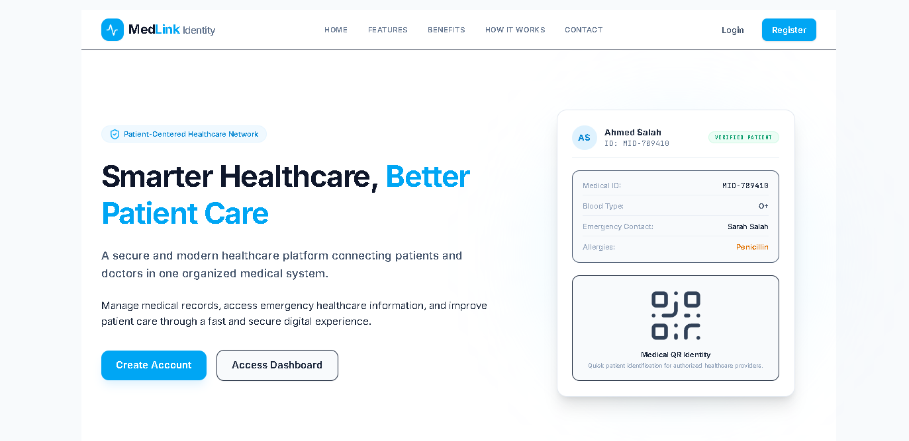
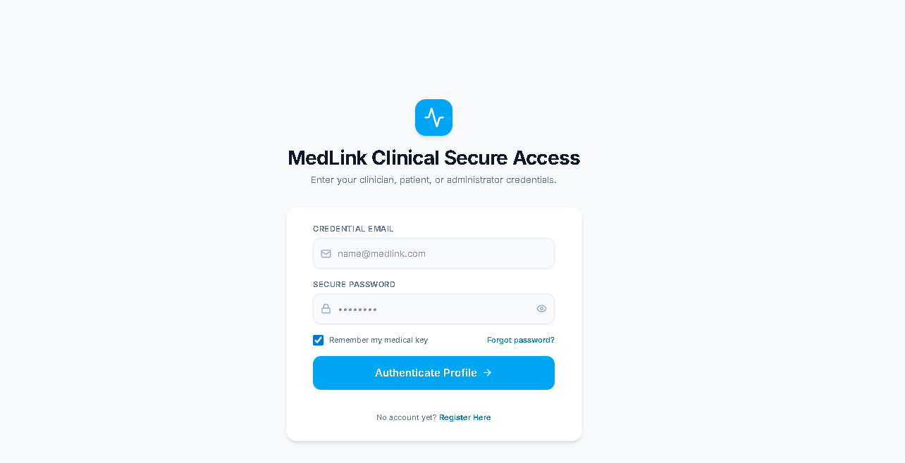
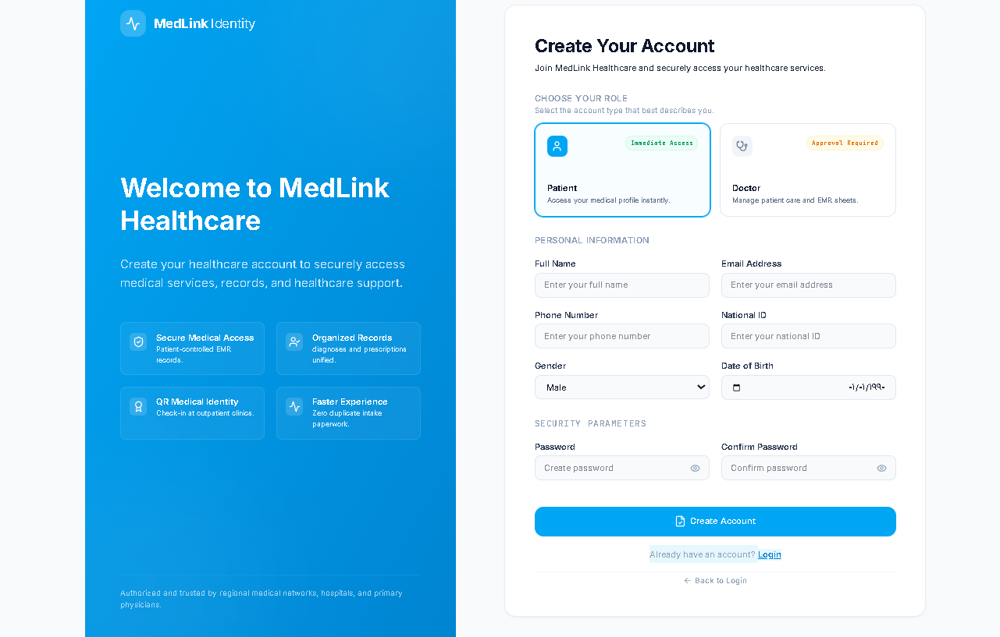
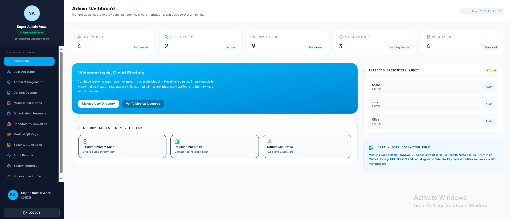
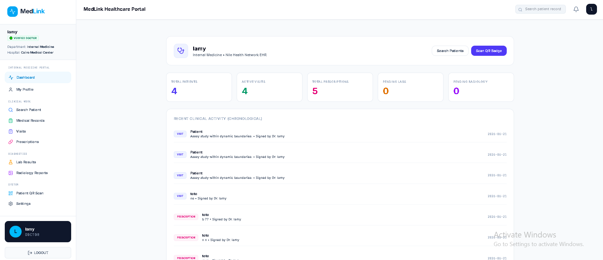
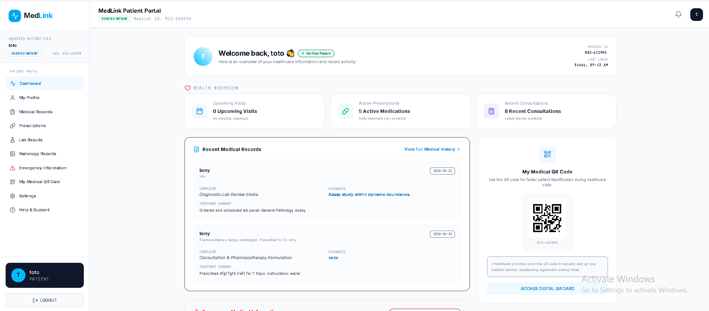

# Medlink Identity: Unified Healthcare Management System

Medlink Identityh is a cutting-edge, hybrid medical ecosystem designed to bridge the gap between healthcare administrators, clinical professionals, and patients. Built using a high-performance **React 18 & Vite Frontend** and a robust **ASP.NET Core 8.0 MVC & Web API Backend**, the platform integrates **Google Cloud Firebase Firestore** for real-time synchronization and secure **JWT-based Firebase Authentication**.

---

## 📸 Platform Screens & Previews

The platform features polished, responsive user interfaces styled with Tailwind CSS and animated using motion libraries. To customize your repository, place your screenshot PNGs inside the `/assets/screenshots/` folder matching the paths below:

| Preview Screen | Description | Relative Image Path |
| :--- | :--- | :--- |
| **1. Public Landing Page** | High-fidelity introductory website showcasing statistics, features, and platform capabilities. | `screenshots/main.png` |
| **2. Authentication portal** | Secure portal featuring dual-layer JWT logins, email validations, and credentials matching. | `screenshots/login.png` |
| **3. Multi-Role Registration** | Seamless sign-up interface allowing users to register as Patients, Doctors, or Insurance partners. | `screenshots/register.png` |
| **4. Central Admin Dashboard** | Control center for approving clinical professionals, managing facilities, and viewing audit logs. | `screenshots/admin.png` |
| **5. Doctor Clinical Workspace** | Clinical dashboard for diagnostics, scheduling, prescriptions, and direct image-linked radiographs. | `screenshots/doctor.png` |
| **6. Patient Wellness Portal** | Client-side hub for patient records, medical cards, wellness charts, and insurance claim tracking. | `screenshots/patient.png` |

### Visual Showcase Gallery

#### 1. Home Landing Page


#### 2. User Login Interface


#### 3. Account Registration Flow


#### 4. System Administrator Dashboard


#### 5. Clinical Doctor Workspace


#### 6. Patient Health & Claims Portal


---

## 👥 Engineering Team Roles & Study Assignments

To reflect a professional team environment, the development of Nile Health was divided among **7 specialized team members**. Below is the division of labor, outlining each person's core responsibility and the exact files they must study and master:

| # | Team Member | Engineering Role | Core Responsibilities | Files to Study & Master |
| :-: | :--- | :--- | :--- | :--- |
| **1** | **Dr. Alexander Wright** | **Team Lead & Core Solutions Architect** | Coordinates end-to-end full-stack systems architecture, routing structures, database security rules, and global state machines. | 📂 `/src/App.tsx`<br>📂 `/firestore.rules`<br>📂 `/aspnet-core-backend/Program.cs`<br>📂 `/metadata.json` |
| **2** | **Sarah Jenkins** | **Senior Backend C# Engineer** | Authored the ASP.NET Core 8.0 MVC architecture, database service integrations, model mapping, and Razor HTML views. | 📂 `/aspnet-core-backend/Controllers/HomeController.cs`<br>📂 `/aspnet-core-backend/FirebaseService.cs`<br>📂 `/aspnet-core-backend/Models.cs`<br>📂 `/aspnet-core-backend/Views/` *(All Razor Files)* |
| **3** | **Michael Chen** | **Senior Frontend Engineer** | Built the React routing system, secure session state context, sidebars, and main authentication layouts. | 📂 `/src/App.tsx`<br>📂 `/src/components/SidebarContent.tsx`<br>📂 `/src/components/Login.tsx`<br>📂 `/src/components/Register.tsx` |
| **4** | **Emily Rodriguez** | **UI/UX & Data Visualization Specialist** | Designed interactive wellness layouts, customized Tailwind CSS global styles, and D3/Recharts components. | 📂 `/src/components/PatientChart.tsx`<br>📂 `/src/components/PublicLanding.tsx`<br>📂 `/src/index.css`<br>📂 `/vite.config.ts` |
| **5** | **David Kalu** | **Clinical Modules Developer** | Developed custom features for doctor, patient, and insurance workspace grids, including claims processing. | 📂 `/src/components/DoctorDashboard.tsx`<br>📂 `/src/components/PatientDashboard.tsx`<br>📂 `/src/components/AdminDashboard.tsx`<br>📂 `/src/types.ts` |
| **6** | **Sophia Al-Fayed** | **Security & Cloud Integrations Expert** | Implemented Firestore read/write filters, token verifications, Cloudinary asset pipelines, and backup database layers. | 📂 `/src/lib/firebase.ts`<br>📂 `/src/lib/firestoreService.ts`<br>📂 `/src/lib/cloudinary.ts`<br>📂 `/src/components/FirebaseStatusPanel.tsx` |
| **7** | **Liam Thompson** | **QA & DevOps Lead** | Created server-side controllers, configured CORS policies, managed package configurations, and automated deployments. | 📂 `/aspnet-core-backend/Controllers/AdminController.cs`<br>📂 `/aspnet-core-backend/Controllers/AuthController.cs`<br>📂 `/aspnet-core-backend/Controllers/RecordsController.cs`<br>📂 `/package.json` |

---

## 📂 Project Directory Structure

```bash
NileHealth/
│
├── aspnet-core-backend/                 # ASP.NET Core 8.0 MVC Backend
│   ├── Controllers/                     # Server-side business logic
│   │   ├── HomeController.cs            # Handles dynamic Razor view bindings (Home/Index, Home/Dashboard)
│   │   ├── AdminController.cs           # Processes facility approvals and audit logs
│   │   ├── AuthController.cs            # Custom JWT validation controller
│   │   └── RecordsController.cs         # CRUD endpoints for medical histories and prescriptions
│   ├── Views/                           # Razor HTML rendering views
│   │   ├── Home/
│   │   │   ├── Index.cshtml             # Modern Tailwind landing view with server-side statistics
│   │   │   └── Dashboard.cshtml         # Server-rendered administrative tables
│   │   ├── Shared/
│   │   │   └── _Layout.cshtml           # Master HTML shell (includes layout grid, Navbar, Footer)
│   │   ├── _ViewImports.cshtml          # Global helper and tag library imports
│   │   └── _ViewStart.cshtml            # Global Razor layout declarations
│   ├── FirebaseService.cs               # Firestore connection orchestrator
│   ├── Models.cs                        # C# Models matching Firebase document schemas
│   ├── Program.cs                       # Server bootstrapper, CORS, and routing pipeline
│   ├── appsettings.json                 # Backend connection strings
│   └── aspnet-core-backend.csproj       # MSBuild project file
│
├── src/                                 # React 18 / Vite Frontend Client
│   ├── components/                      # Modular UI views and screens
│   │   ├── PublicLanding.tsx            # Full interactive marketing website
│   │   ├── Login.tsx                    # Identity verification dashboard
│   │   ├── Register.tsx                 # Dynamic registration form
│   │   ├── AdminDashboard.tsx           # Admin panels with real-time logs
│   │   ├── DoctorDashboard.tsx          # Doctor workspace with direct radiograph images
│   │   ├── PatientDashboard.tsx         # Patient health center and insurance claims
│   │   ├── PatientChart.tsx             # Interactive Recharts and D3 data graphics
│   │   ├── SidebarContent.tsx           # Collapsible side navigation layout
│   │   ├── FirebaseStatusPanel.tsx      # Connectivity and sync indicator
│   │   └── ForgotPassword.tsx           # Account recovery portal
│   ├── lib/                             # External API wrappers & utility layers
│   │   ├── firebase.ts                  # Client connection credentials
│   │   ├── firestoreService.ts          # Advanced query builders and document routers
│   │   ├── cloudinary.ts                # Image upload handling
│   │   └── supabaseService.ts           # Redundant cloud replication layer
│   ├── App.tsx                          # App router and central state coordination
│   ├── index.css                        # Global Tailwind CSS definitions
│   ├── main.tsx                         # Client-side bootstrap file
│   └── types.ts                         # Global TypeScript type and enum declarations
│
├── firestore.rules                      # Production Firestore security and access policies
├── package.json                         # Node dependency manager
└── vite.config.ts                       # Vite compiler configurations
```

---

## 🚀 Setting Up the Project Locally

Follow these precise instructions to launch both the React Frontend and C# MVC Backend on your personal computer:

### 1. Prerequisites
- **Node.js** (v18.0 or higher) & **npm**
- **.NET 8.0 SDK**
- A code editor (e.g., **VS Code** or **Visual Studio 2022**)

---

### 2. Launching the React Frontend Client

1. Navigate to the root directory of the project:
   ```bash
   cd NileHealth
   ```
2. Install the necessary Node packages:
   ```bash
   npm install
   ```
3. Set up your local environment variables. Create a `.env` file in the root:
   ```env
   VITE_FIREBASE_API_KEY=your_key_here
   VITE_FIREBASE_AUTH_DOMAIN=your_auth_domain
   VITE_FIREBASE_PROJECT_ID=ai-studio-51b0b46c-80ba-47ad-8a0c-dc4a7d8c59c7
   VITE_FIREBASE_STORAGE_BUCKET=your_storage_bucket
   VITE_FIREBASE_MESSAGING_SENDER_ID=your_sender_id
   VITE_FIREBASE_APP_ID=your_app_id
   ```
4. Spin up the development server:
   ```bash
   npm run dev
   ```
5. Open your browser and navigate to `http://localhost:3000` to interact with the responsive web client.

---

### 3. Launching the ASP.NET Core 8.0 MVC Backend

1. Navigate to the backend directory:
   ```bash
   cd aspnet-core-backend
   ```
2. Restore all required NuGet dependencies:
   ```bash
   dotnet restore
   ```
3. Configure the Firebase environment path. Download your service account key and reference it in `appsettings.json`:
   ```json
   {
     "Firebase": {
       "ProjectId": "ai-studio-51b0b46c-80ba-47ad-8a0c-dc4a7d8c59c7",
       "CredentialFilePath": "path-to-your-service-account-file.json"
     }
   }
   ```
4. Build and run the server-side application:
   ```bash
   dotnet run
   ```
5. The backend services and server-rendered views are now online:
   - **MVC Home Landing:** `http://localhost:5000/`
   - **Interactive C# Dashboard:** `http://localhost:5000/Home/Dashboard`
   - **Swagger REST API Docs:** `http://localhost:5000/swagger`

---

## 🔒 Security Standards & Enterprise Features
- **Data Protection:** Access rules inside `firestore.rules` verify user credentials before serving document collection reads or writes.
- **Role Isolation:** Only authenticated clinical administrators or doctors can query patient histories or approve requests.
- **Dynamic Charting:** Real-time health metrics render using canvas rendering blocks, with lazy-load data streams that preserve browser memory.
